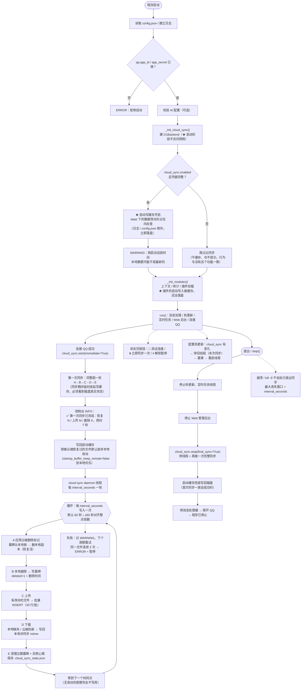
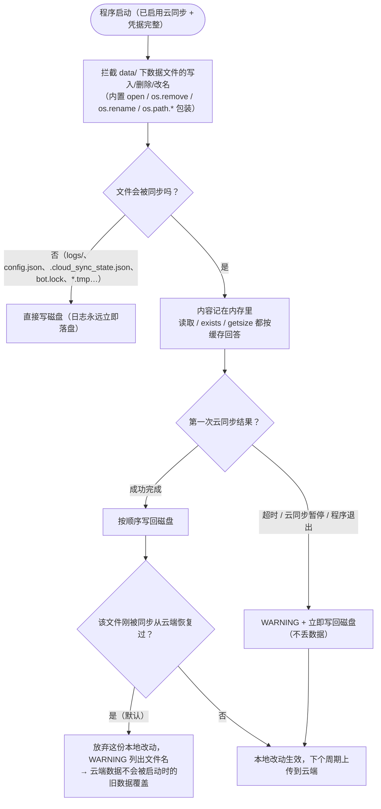
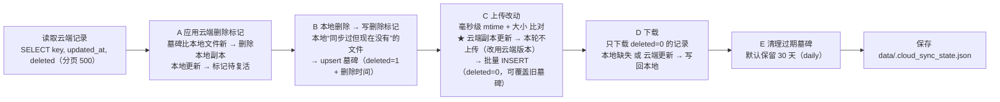
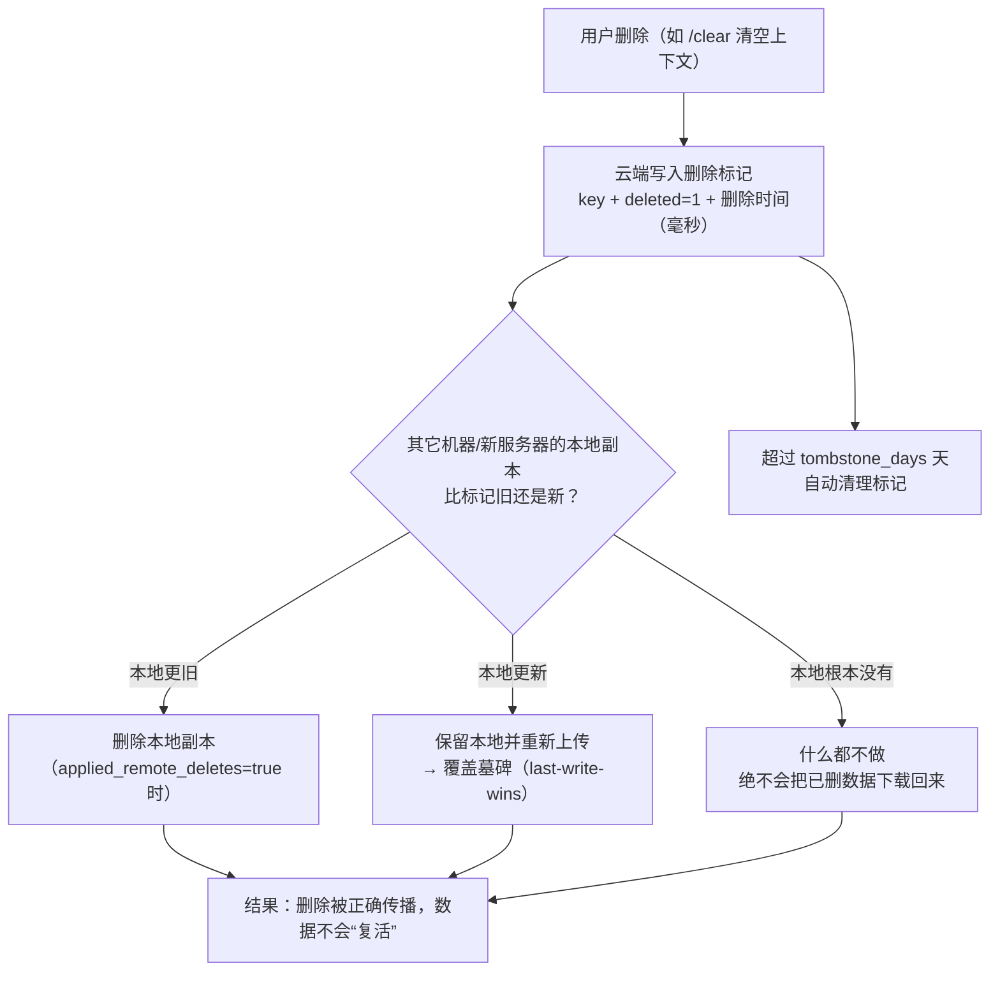
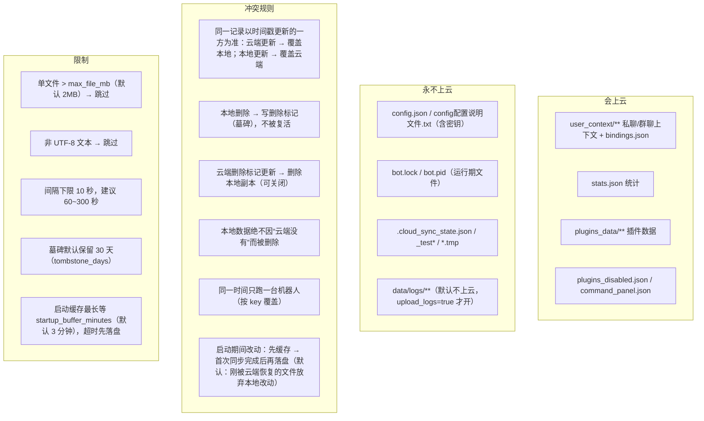

# 云同步全流程图（Mermaid 文本版）

> 图形版见同目录 `云同步流程图.svg`（双击用浏览器打开，可打印或导出 PDF）。
> 逻辑对应 `core/cloud_sync.py` 与 `qqbot.py` 中的挂载点。

## 一、全流程总览



## 一·补、启动写缓存（startup write buffer）



要点：

- **只影响会被同步的数据文件**；日志、`config.json` 等不受影响（永远直接写盘）。
- **没启用云同步（或凭据不完整）时整个机制不生效**：不缓存、不延迟、也没有任何云同步相关提示。
- 同步自己读写的文件（云端下载、`.cloud_sync_state.json`）会**临时挂起**缓存，必须看到磁盘真实状态。
- 等待上限 `cloud_sync.startup_buffer_minutes`（默认 3 分钟），超时就先落盘，避免数据一直不写；
  填 0（不限时间）时也有 30 分钟兜底。
- 容量上限 `cloud_sync.startup_buffer_max_mb`（默认 8MB）：超过就立刻落盘并停止缓存（之后的写入直接写磁盘），
  即使填 0 也有 128MB 硬上限 —— 保证缓存占用的内存永远有界。


## 二、sync_once() 的五个阶段（顺序很重要）



> C 阶段的"云端更新就不上传"很关键：新机器 / 同步状态文件丢失时，本地可能放着很旧的副本，
> 旧逻辑会先把它传上云，于是**云端的较新数据被本地旧数据覆盖**。现在按时间戳判断谁更新，
> 并把决定写进控制台 WARNING（`有 N 个文件的云端版本比本地新…`），下个周期本地已是最新，不会重复提示。

## 二·补、删除墓碑（tombstone）机制




## 三、同步范围与规则



## 四、数据表

```sql
CREATE TABLE IF NOT EXISTS bot_data (
  key        TEXT PRIMARY KEY,   -- 如 data/user_context/private/<openid>.json
  value      TEXT NOT NULL,      -- 文件全文（删除标记时为空）
  updated_at INTEGER NOT NULL,   -- 文件修改时间 / 删除时间（毫秒）
  deleted    INTEGER NOT NULL DEFAULT 0   -- 0=正常文件  1=删除标记（墓碑）
);
```
首次连接由程序自动创建；老版本的表会自动 `ALTER TABLE` 补上 `deleted` 列（「🔌 测试连接」也会做这件事）。
